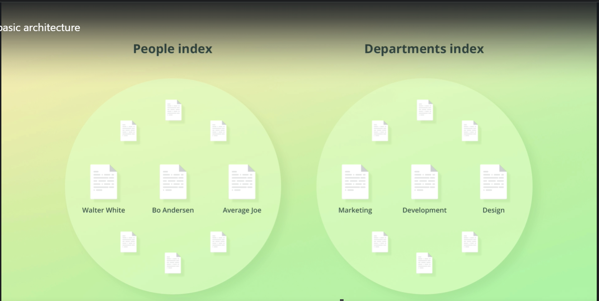

## Architecture
<span style="color: magenta"> Node </span>
- When we start Elasticsearch what actually happens is that we start a node. A node is essentially an instance of elastic search that stores data.

- Each node will store a part of our data.

- A node refers to an instance of Elasticsearch and not a machine, so we can run any number of nodes on the same machine.

<span style="color: yellow"> How is data spread across the nodes?  </span> </br>
- Each node belongs to what is called a cluster.
A <span style="color:red">cluster </span> is a collection of related nodes that together contain all of our data.
We can have many clusters if we want to. Clusters are independent of each other. 

Example: We can have two clusters one for providing the search functionality and other for APM.

<span style="color: yellow">How data is organized and stored? </span> </br>
- Each unit of data that we store within your cluster is called a document.
- Documents are JSON objects containing whatever data we desire.
When we index a document, the original JSON object that we sent to Elasticsearch is stored
along with some metadata that Elasticsearch uses internally.
- The JSON object that we send to Elasticsearch is stored within a field named "_source,"

```JSON
{
    "_index": "Indexname",
    ...
    ...
    "_source": {
        "name" : "Tushar",
        "lastName": "Roy"
    }
}
 ```
<span style="color:yellow">How are documents organized? </span> 

- The answer is within indices.
Every document within Elasticsearch, is stored within an <span style="color:red">index. </span>
- An index groups documents together logically, as well as provide configuration options that
are related to scalability and availability.
An index is therefore a collection of documents that have similar characteristics and are logically related.


- When we get to searching for data, we will see that we specify the index that we want
to search for documents, meaning that search queries are actually run against indices.